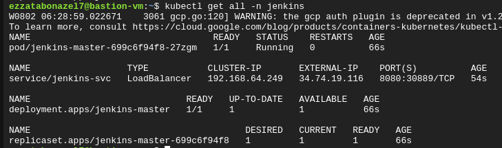
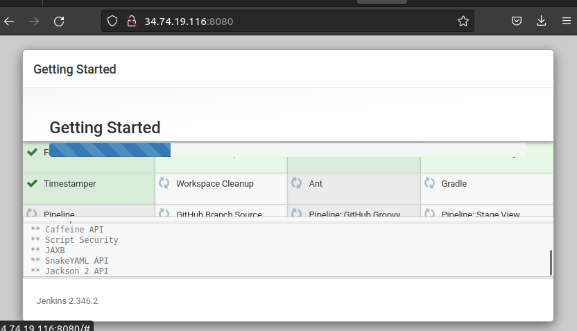

# Deploy-Jenkins-at-GKE Cluster
## Description 

create GCP infrastructure using Terraform , create Docker image for jenkins with Docker 
create kubrenetes yaml files and deploy jenkins on GKE cluster

## Architecture


# Tools used:

- **Docker:** to build an image for jenkins.
- **Kubernetes**: container orchestration system.
- **GCP**: to define GKE cluster to deploy jenkins on it.
- **Terraform**: provision GCP resources.

# Steps to implement 

## Build docker image for jenkins:

```bash
$ docker build -t jenkins-docker .
```
---
## Push docker images to DockerHub:

```bash
#  tags the image
$ docker tag jenkins-docker ezzatabonazel7/jenkins-docker:2.0
```
```bash
# push the image
$ docker push ezzatabonazel7/jenkins-docker:2.0
```

---

## provision GCP infrastructure with Terraform :
- You need to have an account and a project on GCP
- Pass values for the variables defined in a file with the terraform.tfvars name as such:
```
project = "YOUR-PROJECT_ID"
region = "us-central1"
vpc_name="gcp-project-vpc"
managment_subnet_cidr="10.0.0.0/24"
managment_subnet_name="managment"
managment_subnet_region= "us-central1"
restricted_subnet_cidr= "10.0.1.0/24"
restricted_subnet_name= "restricted"
restricted_subnet_region= "us-central1"
vm_type="f1-micro"
machine_type = "e2-micro"
node-count = 1
master_ipv4_cidr_block = "172.12.0.0/28"
services_ipv4_cidr_block = "192.168.0.0/16"
pods_ipv4_cidr_block = "172.17.0.0/16"

```

```bash
$ cd ./terraform-infra

# initialize the backend, provider and modules
$ terraform init

## provisioning infrastructure
$ terraform apply

```
> check GKE creation on GCP:


## Connect to bastion vm and install gcloud, kubectl and connect on GKE cluster :

```bash
# ssh vm
$ gcloud compute ssh --zone <"us-central1-a"> "managment-vm"  --tunnel-through-iap --project <"project-id">
 # connect cluster
$ gcloud container clusters get-credentials my-gke-cluster --region <region> --project <project-id>
```


## Copy jenkins k8s files to the management instance and deploy jenkins:

```bash
$ gcloud compute scp <LOCAL_FILE_PATH> <VM_NAME>
```
```bash
# create k8s resources
$ kubectl create -f  jen-namespce.yaml
$ kubectl create -f  SA.yaml
$ kubectl create -f  volume.yaml
$ kubectl create -f  jenkins-deployment.yaml
$ kubectl create -f  loadbalancer.yaml
```

## get loadbalancer ip and go to your browser :
```bash
$ kubectl get svc -n jenkins

```




## get admin password 
```bash
$ kubectl logs <pod name> -n jenkins

```


## complete setup wizard install recommended plugins 



## Next 
 We will build a Jenkins pipeline to deploy an application on GKE Cluster:
 * You will find it in :
### [CI/CD Deployment with Jenkins On GKE cluster](https://github.com/ezzatabonazel/CI-CD-for-node-app-at-GKE-cluster.git)